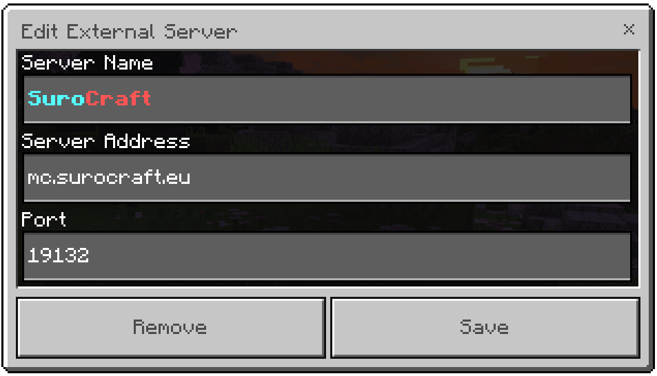

# 📘 ÚVOD


**Tahle verze wiki je zastaralá a považuje se za archivní.**\
**Následující verzi wiki - sezóny 9 - najdeš** [**zde**](http://127.0.0.1:5000/o/aZ6NOOHS7NldfEPmeRv4/s/fzLlukSVmfRk5ZZiGXZl/)**.**


Tato wiki slouží k usnadnění tvého hledání a zároveň k uvolnění času našeho staff týmu.\
Zde by jsi měl najít všechny důležité odpovědi.

Samozřejmě, pokud je nenajdete, neváhejte založit [**ticket**](t/uzitecne.md#ticket) na [**Discord serveru**](https://discord.gg/W4yguRbT34).


**Už si dnes hlasoval pro server? Ne?! Hlasuj ihned** [**zde**](./#vote) **a získej odměnu!**


#### Co na našem serveru najdeš?

Jsme primární survival server. Vše funguje převážně vanilkově. _Hmmm mňam..._\
Ale aby jsme si hru trochu zlepšili a více se bavili, máme tu pár funkcí, které jsou super!

#### Funkce na našem serveru, které mění gameplay:

* [**BlockLocker**](t/blocklocker.md) - zabezpečení beden a více bloků
* **Coordinates** - příkaz `/coords` pro zobrazení souřadnic na java edici ([?](server/slovnik.md#edition))
* **DailyRewards** - denní odměny
* **DeadChest** - posmrtná bedna s inventářem
* [**Elevator**](t/elevator.md) - výtahy
* **Geyser** - podpora Bedrock hráčů
* **GSit** - sedání, lehání a plazení na jakémkoliv místě
* **Heads** - loot hlav mobů a hráčů při zabití
* **LootCrates** - loot bedny na spawnu
* [**Pozemky**](t/arm.md) - pozemky na spawnu
* [**Residence**](t/res.md) - pozemky hráčů po světě
* [**Shopkeepers**](t/shopkeepers.md) - vlastní vesničani pro obchodování
* **TreeGravity** - zničení stromu jedním blokem
* **WorldBorder** - nastavení hranice světů

## Připojení na server 


**Je nutné se nejdříve připojit na** [**Discord server**](https://discord.gg/W4yguRbT34)**.**


Server je dostupný pro Minecraft: **Bedrock Edition** a **Java Edition**\
**Java Edice** je pouze pro operační systémy Windows, macOS a Linux.\
**Bedrock Edice** je určená pro mobilní zařízení a herní konzole. (Mezi nejznámější patří PE - Pocket Edition)

<table data-header-hidden><thead><tr><th>EDICE</th><th align="center">Verze</th><th align="center">IP</th><th width="200">PORT</th></tr></thead><tbody><tr><td><strong>EDICE</strong></td><td align="center"><strong>VERZE</strong></td><td align="center"><strong>ADRESA SERVERU</strong></td><td><strong>PORT</strong></td></tr><tr><td>Java</td><td align="center">1.7 a novější</td><td align="center">mc.surocraft.eu</td><td>25565</td></tr><tr><td>Bedrock</td><td align="center">1.19.80 a novější</td><td align="center">mc.surocraft.eu</td><td>19132</td></tr></tbody></table>

Pro Java Edition hráče doporučujeme používat verzi 1.17 či vyšší pro lepší kompatibilitu.\
Připojením na server souhlasíš s našimi [pravidly](server/rules/).


Nevíš jak se připojit na 'speciální' server s herní konzolí?\
Vyzkoušej aplikaci [**MC Server Connector**](https://play.google.com/store/apps/details?id=com.smokiem.mcserverconnector) pro **Android**.



Připojení s různými módy a neoficiálními klienty je nutné konzultovat se [staff týmem](server/staff.md).


#### Příklad vytvoření nového serveru do server listu v Minecraftu.











## Přispět 

_**Líbí se ti naše práce? Rád hraješ na serveru?**_ _**Podpoř nás prosím!**_

_Platit můžeš službou PayPal, nebo platební kartou._ _Je možnost i poslat peníze na bankovní účet zmíněný dole._

[_**Přispět zde**_](https://linktr.ee/surocraft) (Podpora platebních karet, PayPal)\
[_**Zakoupit si Rank**_](https://surocraft.craftingstore.net/category/275918) (Podpora kreditních a debetních karet, Google Pay, Apple Pay, PayPal)

## Hlasování pro Server 

Proč vlastně hlasovat?\
Hlasováním pro SuroCraft získáš rank [**Wood**](ranks/r.md#wood) na 24h a také [kredity](server/slovnik.md#kredity)!

**Hlasovat pro SuroCraft můžeš na:**\
:one:Hlavní stránce [**zde**](http://l.surocraft.eu/vote1)\
:two:Druhé stránce [**zde**](http://l.surocraft.eu/vote2)\
:three:Třetí stránce [**zde**](http://l.surocraft.eu/vote3)

'Hlasování' je pro nás důležité. :first\_place:\
Náš server se potom dostane na vyšší příčky a může se dostat mezi známější a hledanější server pro získaní dalších hráčů a přátel!

Nebojte se, noví hráči ti akorát zlepší hru.\
Můžeme tím rozšířit naši komunitu a tak ji zachovat aktivní, rozšiřovat obchody (viz. [Shopkeepers](t/shopkeepers.md)) a trochu si více rozradostnit radost z hraní.\
Pokud nový hráč ti nějak začne kazit hru _(to je_ [_pravidlo_](server/rules/#griefing) _mimochodem)_ neváhej založit [**ticket**](t/uzitecne.md#ticket). [Ukládáme data ](server/rules/#ukladane-data-o-hracich)o činnosti hráčů ve hře a tak zjistíme, kdo ti někdo něco rozbil a dokonce i kdy.
