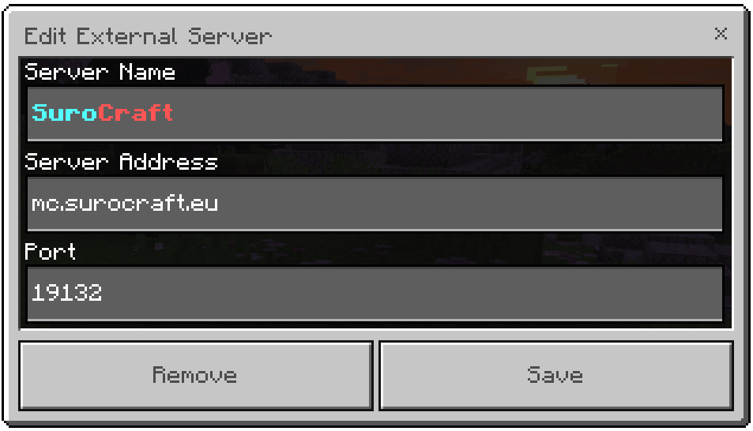

# 📘 ÚVOD

Tato wiki slouží k usnadnění tvého hledání a zároveň k uvolnění času našeho staff týmu.\
Zde by jsi měl najít všechny důležité odpovědi.

Samozřejmě, pokud je nenajdete, neváhejte založit [**ticket**](navody/uzitecne.md#ticket) na [**Discord serveru**](https://discord.gg/W4yguRbT34).


**Nezapomeň navštívit naší užitečnou** [**webovou stránku**](https://surocraft.eu/)**.**



**Najdi chyby ve wiki,** [**nahlaš je nám**](navody/uzitecne.md#ticket) **a získej odměnu!**



**Už si dnes hlasoval pro server? Ne?! Hlasuj ihned** [**zde**](./#vote) **a získej odměnu!**


#### Co na našem serveru najdeš?

Jsme primární survival server. Vše funguje převážně vanilkově. _Hmmm mňam..._\
Ale aby jsme si hru trochu zlepšili a více se bavili, máme tu pár funkcí, které jsou super!

#### Hlavní funkce na našem serveru, které mění gameplay:

_<mark style="color:orange;">Oražová barva značí modifikace, které jsou mimo provoz, ale brzy budou zpět!</mark>_

* <mark style="color:orange;">**Bedny**</mark> <mark style="color:orange;"></mark><mark style="color:orange;">- loot bedny na spawnu</mark>
* [**BlockLocker**](navody/blocklocker.md) - zabezpečení beden a ostatních bloků
* <mark style="color:orange;">**Coordinates**</mark> <mark style="color:orange;"></mark><mark style="color:orange;">- příkaz</mark> <mark style="color:orange;"></mark><mark style="color:orange;">`/coords`</mark> <mark style="color:orange;"></mark><mark style="color:orange;">pro zobrazení souřadnic</mark>
* **DailyRewards** - denní odměny, příkaz `/daily`
* **AngelChest** - posmrtná bedna s inventářem, příkaz `/aclist`
* **Dynmap** - [webová dynmapa](http://map.surocraft.eu/) pro zobrazení světů a online hráčů
* **Ekonomie** - vlastní bankovní systém - **kredity**, např. pro zakoupení [pozemků](navody/lands.md)
* **Geyser** - podpora Bedrock hráčů
* **GSit** - přidání sezení, lehání, plazení a dalších do hry, příkaz `/sit`
* <mark style="color:orange;">**Hlavy**</mark> <mark style="color:orange;"></mark><mark style="color:orange;">- loot hlav mobů při zabití</mark>
* **NPC** - Organizace a zpestření spawnu
* <mark style="color:orange;">**Parkour**</mark> <mark style="color:orange;"></mark><mark style="color:orange;">- parkour mapy</mark>
* [**Pozemky**](navody/lands.md) - místa pro obchody, příkaz `/lands`
* **Questy** - každodenní úkoly pro obohacení hry, za které získáš kredity
* [**Residence**](navody/rezidence.md) - chráněné oblasti hráčů po světech, příkaz `/res`
* [**Shopkeepers**](navody/shopkeepers.md) - vlastní vesničani pro obchodování, příkaz `/shop`
* **SilkSpawners** - možnost vytěžení spawnerů silk touchem
* **Sleep-most** - umožnení přeskočení noci pomocí jen určitého počtu hráčů
* **Statistiky** - různé statistiky a žebříčky pro soutěžení
* **TreeCapitator** - zničení stromu jedním blokem
* [**Výtahy**](navody/vytahy.md) - výtahy pro rychlý přesun
* **WorldBorder** - nastavení hranice světů

## Připojení na server 


**Je nutné se nejdříve připojit na** [**Discord server**](https://discord.gg/W4yguRbT34)**.**


Server je dostupný pro Minecraft: **Bedrock Edition** a **Java Edition**\
**Java Edice** je pouze pro operační systémy Windows, macOS a Linux.\
**Bedrock Edice** je určená pro mobilní zařízení a herní konzole. (Mezi nejznámější patří PE - Pocket Edition)

_Nejaktualizovanější informace najdeš na našem webu_ [_zde_](https://surocraft.eu/#join)_._

<table data-header-hidden><thead><tr><th>EDICE</th><th align="center">VERZE</th><th align="center">IP</th><th width="200">PORT</th></tr></thead><tbody><tr><td><strong>EDICE</strong></td><td align="center"><strong>VERZE</strong></td><td align="center"><strong>IP ADRESA</strong></td><td><strong>PORT</strong></td></tr><tr><td>Java</td><td align="center">1.9 a novější</td><td align="center">mc.surocraft.eu</td><td>25565</td></tr><tr><td>Bedrock</td><td align="center">1.21.2 a novější</td><td align="center">mc.surocraft.eu</td><td>19132</td></tr></tbody></table>

Pro Java Edition hráče doporučujeme používat verzi 1.17 či vyšší pro lepší kompatibilitu.\
_**Připojením na server souhlasíš s našimi**_ [_**pravidly**_](server/pravidla/)_**.**_


Potřebuješ poradit s připojením na ostatní servery s herní konzolí?\
Vyzkoušej aplikaci [**MC Server Connector**](https://play.google.com/store/apps/details?id=com.smokiem.mcserverconnector) pro **Android**.



Připojení s různými módy a neoficiálními klienty je nutné konzultovat se [staff týmem](server/staff.md).


#### Příklad vytvoření nového serveru do server listu v Minecraftu.











## Přispět 

_**Líbí se ti naše práce? Rád hraješ na serveru?**_ _**Podpoř nás prosím!**_\
[_**Zakoupit si Rank**_](https://www.patreon.com/surocraft) (Podpora kreditních a debetních karet, Google Pay, Apple Pay, PayPal)

## Hlasování pro Server 

Proč vlastně hlasovat?\
Hlasováním pro SuroCraft získáš rank [**Wood**](ranky/seznam.md#wood) na 24 hodin a také [kredity](server/slovnicek.md#kredity)!

**Hlasovat pro SuroCraft můžeš na:**\
:one:Hlavní stránce [**zde**](http://l.surocraft.eu/vote1)\
:two:Druhé stránce [**zde**](http://l.surocraft.eu/vote2)\
:three:Třetí stránce [**zde**](http://l.surocraft.eu/vote3)

'Hlasování' je pro nás důležité. :first\_place:\
Náš server se potom dostane na vyšší příčky a může se dostat mezi známější a hledanější server pro získaní dalších hráčů a přátel!

Nebojte se, noví hráči ti akorát zlepší hru.\
Můžeme tím rozšířit naši komunitu a tak ji zachovat aktivní, rozšiřovat obchody (viz. [Shopkeepers](navody/shopkeepers.md)) a trochu si více rozradostnit radost z hraní.\
Pokud nový hráč ti nějak začne kazit hru _(to je_ [_pravidlo_](server/pravidla/#griefing) _mimochodem)_ neváhej založit [**ticket**](navody/uzitecne.md#ticket). [Ukládáme data ](server/pravidla/#ukladane-data-o-hracich)o činnosti hráčů ve hře a tak zjistíme, kdo ti někdo něco rozbil a dokonce i kdy.
