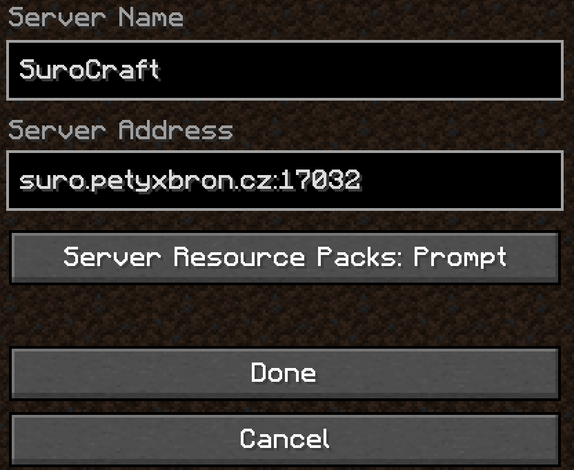
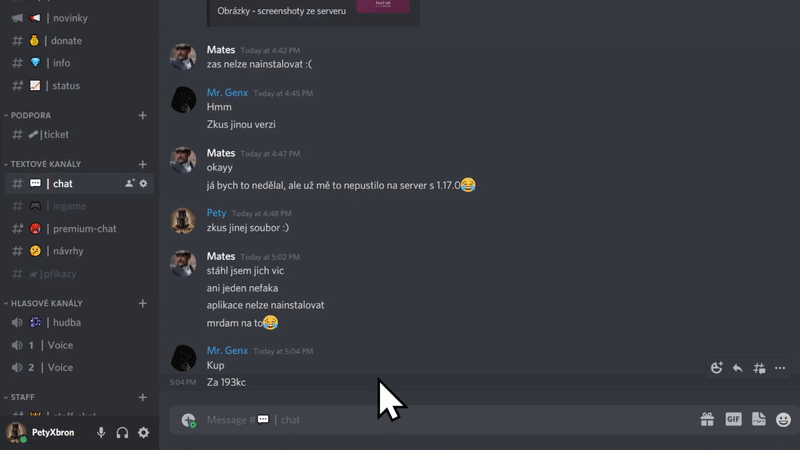

# Užitečné

## Příkazy

### Portovací příkazy 

* [x] Rank Hráč+

Pro ulehčení práce vaším kostičkovaným nohám jsme přidali příkazy

* `/spawn`
* `/end`

Logicky, `/spawn` příkaz tě portne na spawn. Na spawnu máme obchody a výstavku. Jedná se tak o "Serverové tržiště", či "Serverové Náměstí".

Pozor! `/spawn` příkaz je funkční pouze ve světě overworld \([?](https://minecraft.fandom.com/wiki/Overworld)\).  
Když ho použiješ v Netheru \([?](https://minecraft.fandom.com/wiki/The_Nether)\), portne tě na spawn Netheru \([?](https://minecraft.fandom.com/wiki/The_Nether)\) a když v Endu \([?](https://minecraft.fandom.com/wiki/The_End)\), napíše ti to, že nemáš právo. Je to takové mírně otravné, ale zase ti to tak neulehčuje hru.

Příkaz `/end` tě portne k End portálu \([?](https://minecraft.fandom.com/wiki/End_portal)\).


**Příkaz `/end` má cooldown 10 minut.**


### Přehození předmětu do druhé ruky 

* [x] **Pouze Bedrock hráči**
* [x] **Rank Hráč+**

Každý uživatel Bedrock edice \([?](../server/slovnik.md#bedrock-java-edition)\) může ve hře použít příkaz `/geyser offhand`  
Po použití příkazu se aktuální předmět nebo blok přesune do druhé ruky.

Tento příkaz je dostupný pouze Bedrock hráče a na Javě je zablokovaný. Pokud chceš si chceš na Javě dát do druhé ruky předmět nebo blok, výchoze je to nastaveno na klávese `f`. Nebo v inventáři můžeš taky předmět nebo blok přetáhnout do okénka se štítem.

## Ostatní

### Podpora - Založení ticketu 

Nevíš jak kontaktovat Admin Team? Zde máš návod.

#### 1. Připojení k Discordu 

Nejdříve se musíš připojit na Discord server. Odkaz [**zde**](https://dsc.gg/surocraft).  
Pokud si tak ještě neudělal, přečti si [pravidla serveru](../server/rules.md).

#### 2. Založení ticketu v kanále 

Běž v Discord serveru do kanálu **\#ticket**, zde uvidíš zprávu pod které je tlačítko. Na to klikneš a vytvoří se nový kanál, tam si můžeme začít psát.

