# 📷 GALERIE


**Chceš přispět do galerie? Založ** [**ticket**](t/uzitecne.md#ticket)**.**


### Aktuální

   

### Hráčské výtvory

![Rezidence GraysKingdom (VivianGray3681) \[S7\]](.gitbook/assets/Screenshot\_608.png) ![Rezidence Sušenkovice (Sehi06, Alexholoubek200) \[S7\]](.gitbook/assets/Screenshot\_557.png) ![Rezidence AtomovyBunkr04 (Dominen, Smrtka\_sk, VikyDee) \[S7\]](.gitbook/assets/Screenshot\_559.png) ![Rezidence Ber1s (Ber1s) \[S7\]](.gitbook/assets/Screenshot\_595.png) ![Rezidence GraysVillage (VivianGray3681) \[S7\]](.gitbook/assets/Screenshot\_597.png) ![Rezidence Sušenkovice (Martin\_Kawecki) \[v2\] \[S7\]](.gitbook/assets/Screenshot\_612.png) ![Replika Eiffelovy věže (SourJupiter4247) \[S7\]](.gitbook/assets/Screenshot\_627.png) ![Rezidence pevnost (CzProky22) \[S7\]](.gitbook/assets/Screenshot\_641.jpg) ![Rezidence Kawecki (Martin\_Kawecki) \[Dříve Sušenkovice,  v3\] \[S7\]](.gitbook/assets/Screenshot\_642.png) ![Rezidence PredysCastle (GeraltCZ5214 - PredysCZ) \[S7\]](.gitbook/assets/Screenshot\_645.png)   

### Události

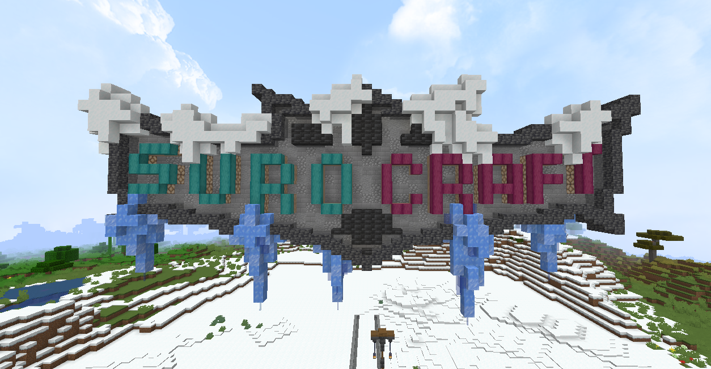

 

 

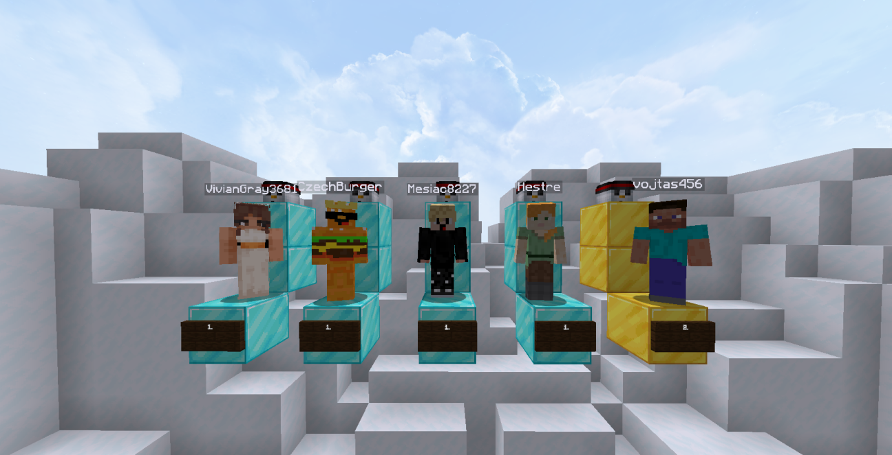

 

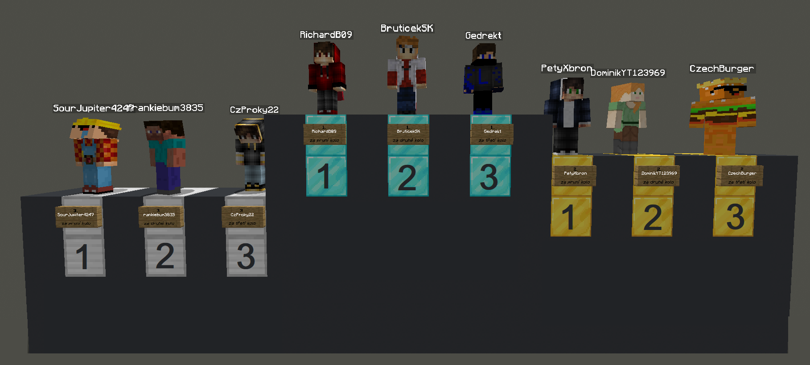

 

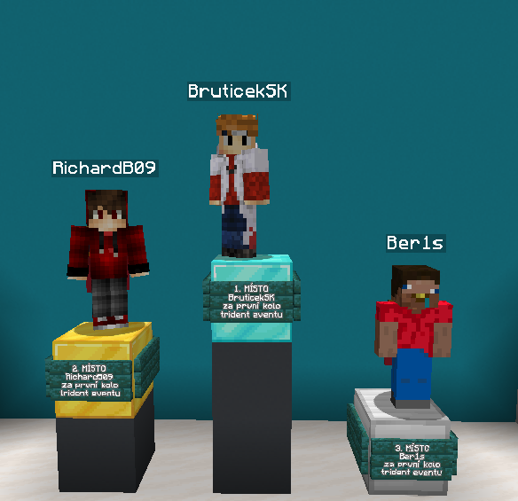

 

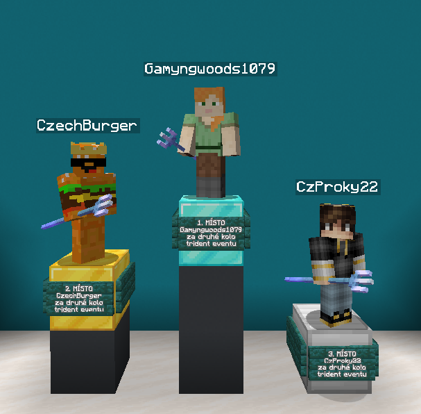

 

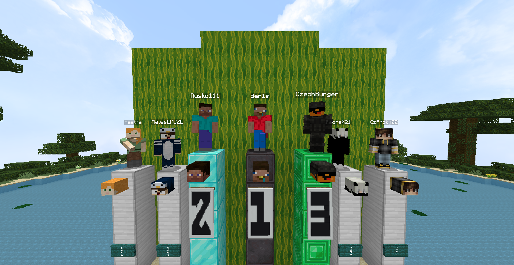

 

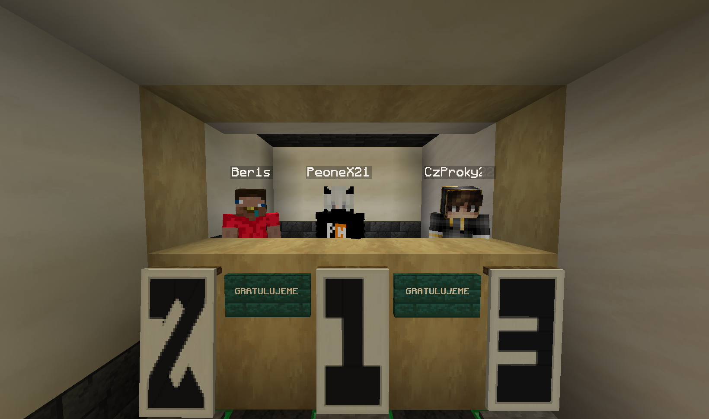

 

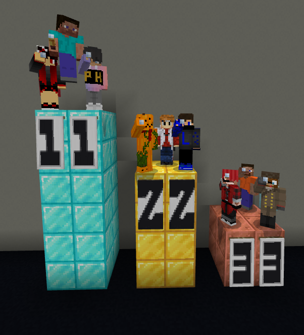

 

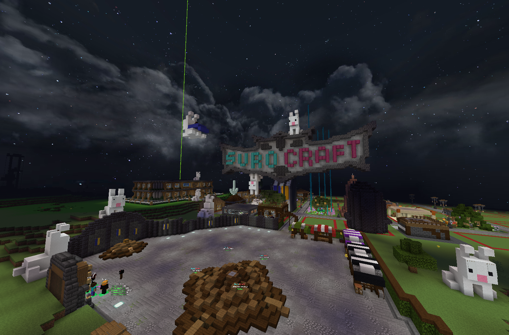

 

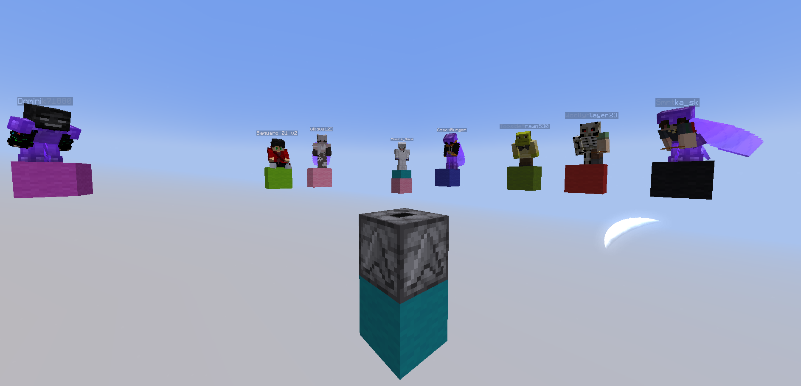

 

<figure>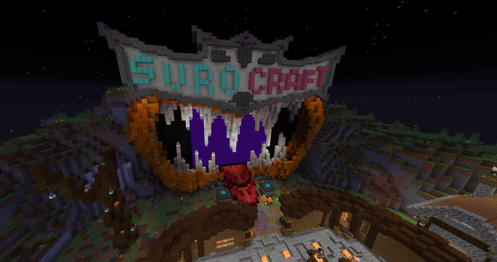<figcaption>
Hallowenský spawn
</figcaption></figure>

 

<figure>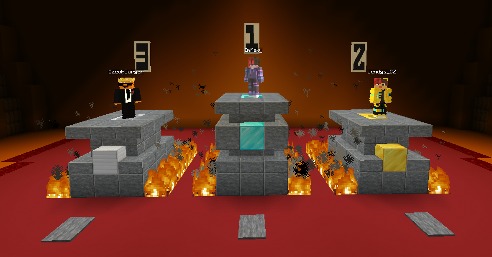<figcaption>
Výherci Halloween eventu 30.10.2022, pořádaný <a href="server/staff.md#smrtka_sk">Smrtkou</a>
</figcaption></figure>

### Historie

![Hráči v podzemí (BruticekSK, Smrtka\_sk, ppman\_SK) \[S6\]](.gitbook/assets/unknown5.jpg) ![Minecraft spawn \[S6\]](.gitbook/assets/Screenshot\_545.png) ![Stará generace světa - zajímavý biom \[S6\]](.gitbook/assets/screenshot\_mahspy.png) ![Minecraft Banner u spawnu \[S7\]](.gitbook/assets/Screenshot\_523.png) ![Minecraft spawn \[S7\]](.gitbook/assets/Screenshot\_646.png) ![Hráčské pozemky na spawnu \[S7\]](.gitbook/assets/Screenshot\_593.png)
