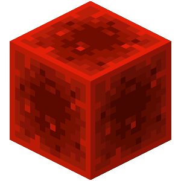
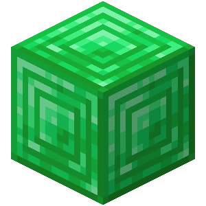
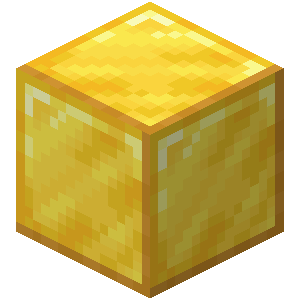
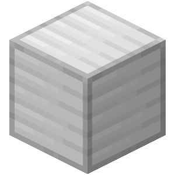
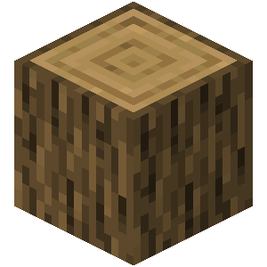

# ⭐ Ranky a jejich výhody

## TABULKA VÝHOD 

<table data-full-width="true"><thead><tr><th width="217">Funkce</th><th align="center">Wood</th><th align="center">Iron</th><th align="center">Gold</th><th align="center">Diamond</th><th align="center">Emerald</th><th align="center">Redstone</th></tr></thead><tbody><tr><td>Počet homes</td><td align="center">1</td><td align="center">3</td><td align="center">5</td><td align="center">8</td><td align="center">20</td><td align="center">50</td></tr><tr><td>Počet shopkeeperů (<a href="../t/shopkeepers.md">?</a>)</td><td align="center">1</td><td align="center">2</td><td align="center">4</td><td align="center">10</td><td align="center">∞</td><td align="center">∞</td></tr><tr><td>Počet rezidencí (<a href="../t/res.md">?</a>)</td><td align="center">1</td><td align="center">2</td><td align="center">4</td><td align="center">5</td><td align="center">7</td><td align="center">10</td></tr><tr><td>Velikost rezidence (<a href="../t/res.md">?</a>)</td><td align="center">100²</td><td align="center">300²</td><td align="center">600²</td><td align="center">700²</td><td align="center">1000²</td><td align="center">2000²</td></tr><tr><td>Čas na vyzvednutí DeathChest</td><td align="center">3 h</td><td align="center">10 h</td><td align="center">12 h</td><td align="center">24 h</td><td align="center">48 h</td><td align="center">120 h</td></tr><tr><td>Příkaz <code>/fly</code></td><td align="center">❌</td><td align="center">❌</td><td align="center">❌</td><td align="center">❌</td><td align="center">✅</td><td align="center">✅</td></tr><tr><td>Příkaz <code>/back</code></td><td align="center">❌</td><td align="center">❌</td><td align="center">❌</td><td align="center">✅</td><td align="center">✅</td><td align="center">✅</td></tr><tr><td>Imunita proti AFK kick</td><td align="center">❌</td><td align="center">❌</td><td align="center">✅</td><td align="center">✅</td><td align="center">✅</td><td align="center">✅</td></tr><tr><td>Příkaz <code>/nick</code></td><td align="center">❌</td><td align="center">✅</td><td align="center">✅</td><td align="center">✅</td><td align="center">✅</td><td align="center">✅</td></tr></tbody></table>

_Tabulka nevyznačuje všechny výhody. Ty jsou dostupné pod každým rankem, pod tlačítkem._

### Redstone 

* **JIŽ BRZY VÍCE** (Na ranku pořád pracujeme a budeme přidávat ty nejlepší výhody)
* `/kit redstone` (Udělí ti ULTRA FLEX :sunglasses: a OP 💎 nástroje s brněním \[získatelné v survivalu])
* `/spin` (Spustí animaci točení hráče, jako s trojzubcem)
* Bez cooldownu na `/pvpset`
* Možnost přenastavit spawner vejcem

<table><thead><tr><th width="289">Funkce</th><th>Počet / Limit</th></tr></thead><tbody><tr><td>Počet homes</td><td>50</td></tr><tr><td>Počet shopkeeperů (<a href="../t/shopkeepers.md">?</a>)</td><td>Neomezený</td></tr><tr><td>Počet rezidencí (<a href="../t/res.md">?</a>)</td><td>10</td></tr><tr><td>Velikost rezidence (<a href="../t/res.md">?</a>)</td><td>2000 x 2000</td></tr><tr><td>Čas na vyzvednutí DeathChest</td><td>120 hodin</td></tr></tbody></table>

* Výhody z předchozích ranků (viz. zobrazení všech výhod Redstone Ranku)

Zobrazit všechny výhody Redstone Ranku 

* `/back` (Vrátí tě na místo, kde jsi umřel, nebo odkud si byl naposledy teleportován)
* `/hat` (Drž v ruce blok, který si chceš nasadit na hlavu)
* `/seed`
* `/anvil` (Otevře kovadlinu)
* `/enderchest` (Otevře ender bednu)
* `/stonecutter` (Otevře kameník)
* `/tpa` (Zeptat se hráče, jestli se můžeš za ním teleportovat)
* `/end` ([?](../t/uzitecne.md#tp))
* `/tpr` ([?](../t/uzitecne.md#tp))
* `/nick` (Změní ti jméno v chatu)
* `/workbench` (Otevře crafting table 3x3)
* Možnost psát barevně do chatu ([?](help.md#psani-barevne-do-chatu))
* Barevná přezdívka ([?](help.md#barevna-prezdivka))
* `/kit redstone`(Udělí ti ULTRA FLEX :sunglasses: a OP nástroje s brněním)
* `/spin` (Spustí animaci točení hráče, jako s trojzubcem)
* Imunita na vyhození při AFK
* Možnost vytěžit spawner se silk touchem (100% šance)
* Možnost vytěžit spawner výbuchem TNT (10% šance)
* Možnost přenastavit spawner vejcem
* Limit 50x home
* Neomezený počet Shopkeeperů ([?](../t/shopkeepers.md))
* Limit 10 rezidencí ([?](../t/res.md))
* Max. velikost rezidence 2000 x 2000
* 120 hodin na vyzvednutí DeadChest

### Emerald 

* `/fly`

<table><thead><tr><th width="289">Funkce</th><th>Počet / Limit</th></tr></thead><tbody><tr><td>Počet homes</td><td>20</td></tr><tr><td>Počet shopkeeperů (<a href="../t/shopkeepers.md">?</a>)</td><td>Neomezený</td></tr><tr><td>Počet rezidencí (<a href="../t/res.md">?</a>)</td><td>7</td></tr><tr><td>Velikost rezidence (<a href="../t/res.md">?</a>)</td><td>1000 x 1000</td></tr><tr><td>Čas na vyzvednutí DeathChest</td><td>48 hodin</td></tr></tbody></table>

* Výhody z předchozích ranků (viz. zobrazení všech výhod Emerald Ranku)

Zobrazit všechny výhody Emerald Ranku 

* `/back` (Vrátí tě na místo, kde jsi umřel, nebo odkud si byl naposledy teleportován)
* `/hat` (Drž v ruce blok, který si chceš nasadit na hlavu)
* `/seed`
* `/anvil` (Otevře kovadlinu)
* `/enderchest` (Otevře ender bednu)
* `/stonecutter` (Otevře kameník)
* `/tpa` (Zeptat se hráče, jestli se můžeš za ním teleportovat)
* `/end` ([?](../t/uzitecne.md#tp))
* `/tpr` ([?](../t/uzitecne.md#tp))
* `/nick` (Změní ti jméno v chatu)
* `/workbench` (Otevře crafting table 3x3)
* Možnost psát barevně do chatu ([?](help.md#psani-barevne-do-chatu))
* Barevná přezdívka ([?](help.md#barevna-prezdivka))
* Imunita na vyhození při AFK
* Možnost vytěžit spawner se silk touchem (100% šance)
* Možnost vytěžit spawner výbuchem TNT (10% šance)
* Limit 20x home
* Neomezený počet Shopkeeperů ([?](../t/shopkeepers.md))
* Limit 7 rezidencí ([?](../t/res.md))
* Max. velikost rezidence 1000 x 1000
* 48 hodin na vyzvednutí DeadChest

### Diamond 

* `/back` (Vrátí tě na místo, kde jsi umřel, nebo odkud si byl naposledy teleportován)
* `/hat` (Drž v ruce blok, který si chceš nasadit na hlavu)
* `/seed`
* `/trash`
* Barevná přezdívka ([?](help.md#barevna-prezdivka))
* Možnost psát barevně do chatu ([?](help.md#psani-barevne-do-chatu))

<table><thead><tr><th width="289">Funkce</th><th>Počet / Limit</th></tr></thead><tbody><tr><td>Počet homes</td><td>8</td></tr><tr><td>Počet shopkeeperů (<a href="../t/shopkeepers.md">?</a>)</td><td>10</td></tr><tr><td>Počet rezidencí (<a href="../t/res.md">?</a>)</td><td>5</td></tr><tr><td>Velikost rezidence (<a href="../t/res.md">?</a>)</td><td>700 x 700</td></tr><tr><td>Čas na vyzvednutí DeathChest</td><td>24 hodin</td></tr></tbody></table>

* Výhody z předchozích ranků (viz. zobrazení všech výhod Diamond Ranku)

Zobrazit všechny výhody Diamond Ranku 

* `/back` (Vrátí tě na místo, kde jsi umřel, nebo odkud si byl naposledy teleportován)
* `/hat` (Drž v ruce blok, který si chceš nasadit na hlavu)
* `/anvil` (Otevře kovadlinu)
* `/enderchest` (Otevře ender bednu)
* `/stonecutter` (Otevře kameník)
* `/tpa` (Zeptat se hráče, jestli se můžeš za ním teleportovat)
* `/end` ([?](../t/uzitecne.md#tp))
* `/tpr` ([?](../t/uzitecne.md#tp))
* `/nick` (Změní ti jméno v chatu)
* `/workbench` (Otevře crafting table 3x3)
* Možnost psát barevně do chatu ([?](help.md#psani-barevne-do-chatu))
* Barevná přezdívka ([?](help.md#barevna-prezdivka))
* Imunita na vyhození při AFK
* Možnost vytěžit spawner se silk touchem (100% šance)
* Možnost vytěžit spawner výbuchem TNT (10% šance)
* Limit 8x home
* Limit 10 Shopkeeperů ([?](../t/shopkeepers.md))
* Možnost psát barevně do chatu ([?](help.md#psani-barevne-do-chatu))
* Limit 5 rezidencí ([?](../t/res.md))
* Max. velikost rezidence 700 x 700
* 24 hodin na vyzvednutí DeadChest

### Gold 

* `/enderchest` (Otevře ender bednu)
* `/anvil` (Otevře kovadlinu)
* `/stonecutter` (Otevře kameník)
* Imunita na vyhození při AFK
* Možnost vytěžit spawner se silk touchem (100% šance)
* Možnost vytěžit spawner výbuchem TNT (10% šance)

<table><thead><tr><th width="289">Funkce</th><th>Počet / Limit</th></tr></thead><tbody><tr><td>Počet homes</td><td>5</td></tr><tr><td>Počet shopkeeperů (<a href="../t/shopkeepers.md">?</a>)</td><td>4</td></tr><tr><td>Počet rezidencí (<a href="../t/res.md">?</a>)</td><td>4</td></tr><tr><td>Velikost rezidence (<a href="../t/res.md">?</a>)</td><td>600 x 600</td></tr><tr><td>Čas na vyzvednutí DeathChest</td><td>12 hodin</td></tr></tbody></table>

* Výhody z předchozích ranků (viz. zobrazení všech výhod Gold Ranku)

Zobrazit všechny výhody Gold Ranku 

* `/anvil` (Otevře kovadlinu)
* `/enderchest` (Otevře ender bednu)
* `/stonecutter` (Otevře kameník)
* `/tpa` (Zeptat se hráče, jestli se můžeš za ním teleportovat)
* `/end` ([?](../t/uzitecne.md#tp))
* `/tpr` ([?](../t/uzitecne.md#tp))
* `/nick` (Změní ti jméno v chatu)
* `/workbench` (Otevře crafting table 3x3)
* Imunita na vyhození při AFK
* Možnost vytěžit spawner se silk touchem (100% šance)
* Možnost vytěžit spawner výbuchem TNT (10% šance)
* Limit 5x home
* Limit 4 Shopkeepeři ([?](../t/shopkeepers.md))
* Limit 4 rezidence ([?](../t/res.md))
* Max. velikost rezidence 600 x 600
* 12 hodin na vyzvednutí DeadChest

### Iron 

* `/kit iron` (Udělí ti Iron kit nástroje a brnění)
* `/nick` (Změní ti jméno v chatu)
* `/workbench` (Otevře crafting table 3x3)

<table><thead><tr><th width="289">Funkce</th><th>Počet / Limit</th></tr></thead><tbody><tr><td>Počet homes</td><td>3</td></tr><tr><td>Počet shopkeeperů (<a href="../t/shopkeepers.md">?</a>)</td><td>2</td></tr><tr><td>Počet rezidencí (<a href="../t/res.md">?</a>)</td><td>2</td></tr><tr><td>Velikost rezidence (<a href="../t/res.md">?</a>)</td><td>300 x 300</td></tr><tr><td>Čas na vyzvednutí DeathChest</td><td>10 hodin</td></tr></tbody></table>

* Výhody z předchozích ranků (viz. zobrazení všech výhod Iron Ranku)

Zobrazit všechny výhody Iron Ranku 

* `/tpa` (Zeptat se hráče, jestli se můžeš za ním teleportovat)
* `/end` ([?](../t/uzitecne.md#tp))
* `/tpr` ([?](../t/uzitecne.md#tp))
* `/nick` (Změní ti jméno v chatu)
* `/workbench` (Otevře crafting table 3x3)
* Vyhození po hodině AFK
* Limit 3x home
* Limit 2 Shopkeepeři ([?](../t/shopkeepers.md))
* Limit 2 rezidence ([?](../t/res.md))
* Max. velikost rezidence 300 x 300
* 10 hodin na vyzvednutí DeadChest

### Wood 

**Rank za vote** ([?](../#vote)).


**Hlasuj pro náš server** [**zde**](https://vote.petyxbron.cz/) **a získej Wood rank!**


* `/tpa` (Zeptat se hráče, jestli se můžeš za ním teleportovat)
* `/end` ([?](../t/uzitecne.md#tp))
* `/tpr` ([?](../t/uzitecne.md#tp))
* Vyhození po hodině AFK

<table><thead><tr><th width="289">Funkce</th><th>Počet / Limit</th></tr></thead><tbody><tr><td>Počet homes</td><td>1 (postel)</td></tr><tr><td>Počet shopkeeperů (<a href="../t/shopkeepers.md">?</a>)</td><td>1</td></tr><tr><td>Počet rezidencí (<a href="../t/res.md">?</a>)</td><td>1</td></tr><tr><td>Velikost rezidence (<a href="../t/res.md">?</a>)</td><td>100 x 100</td></tr><tr><td>Čas na vyzvednutí DeathChest</td><td>3 hodin</td></tr></tbody></table>

## Jak získat ranky 

Stačí navštívit naší stránku s obchodem - [surocraft.craftingstore.net](https://surocraft.craftingstore.net/) nebo [surocraft.eu/shop/](https://surocraft.eu/shop/)\
Tam si můžeš v záložce kategorií zvolit [kategorii ranky](https://surocraft.craftingstore.net/category/275918) a vybrat si svůj vyhovující rank.

### CENY RANKŮ 

| **Rank**                                                                                                             | **Cena**                | **Platnost** |
| -------------------------------------------------------------------------------------------------------------------- | ----------------------- | ------------ |
| <mark style="color:orange;">Wood</mark>       | Za vote ([?](../#vote)) | 24 hodin     |
| Iron                                          | _Aktuálně neprodejné_   | 30 dní       |
| <mark style="color:yellow;">Gold</mark>       | 50 Kč (\~ 2 €)          | 30 dní       |
| <mark style="color:blue;">Diamond</mark>   | 100 Kč (\~ 4 €)         | 30 dní       |
| <mark style="color:green;">Emerald</mark>  | 200 Kč (\~ 8 €)         | 30 dní       |
| <mark style="color:red;">Redstone</mark>  | 350 Kč (\~ 15 €)        | 30 dní       |

_Před zakoupením ranku je nutné souhlasit s podmínkami služeb._\
_Ceny jsou uvedeny pouze v korunách českých (převod měn zařizuje platební brána)._

### OSTATNÍ RANKY 

<mark style="color:red;background-color:red;">YouTube rank</mark>

* Obsahuje veškeré výhody z ranku [Gold](r.md#gold)

#### Podmínky pro získání YouTube ranku:

1. Název kanálu se musí shodovat s Minecraft jménem
2. Minimálně 100 odběratelů
3. Minimálně 6 hodin nahraného času na serveru
4. Časté videa/streamy (minimálně 1x za měsíc)
5. Dobrá reprezentace serveru a dodržování pravidel serveru
6. Jméno "SuroCraft" v názvech videí/streamů
7. IP, případně i odkazy na SuroCraft v popiscích videí/streamů

Aktualizováno 18.04.2023\
Staff ve vlastním zájmu může určit výjimky podmínek pro některé hráče s rankem.

