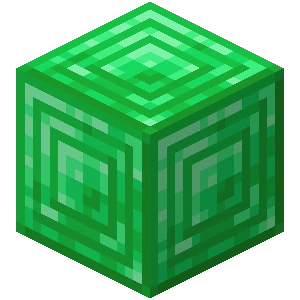

# ⭐ Ranky a jejich výhody

## Výhody

### Emerald 

* `/kit emerald` (Udělí ti ULTRA FLEX :sunglasses: a OP nástroje s brněním)
* `/spin` (Spustí animaci točení hráče, jako s trojzubcem)
* `/fly`
* Limit 20x home
* Neomezený počet Shopkeeperů ([?](../t/shopkeepers.md))
* Limit 10 rezidencí ([?](../t/res.md))
* Max. velikost rezidence 2500x2500
* 72 hodin na vyzvednutí DeadChest
* Výhody z předchozích ranků (viz. zobrazení všech výhod Emerald Ranku)

Zobrazit všechny výhody Emerald Ranku 

* `/back` (Vrátí tě na místo, kde jsi umřel, nebo odkud si byl naposledy teleportován)
* `/hat` (Drž v ruce blok, který si chceš nasadit na hlavu)
* `/seed`
* `/anvil` (Otevře kovadlinu)
* `/enderchest` (Otevře ender bednu)
* `/stonecutter` (Otevře kameník)
* `/tpa` (Zeptat se hráče, jestli se můžeš za ním teleportovat)
* `/end` ([?](../t/uzitecne.md#tp))
* `/tpr` ([?](../t/uzitecne.md#tp))
* `/nick` (Změní ti jméno v chatu)
* `/workbench` (Otevře crafting table 3x3)
* DeadChest vypadá jako ender bedna, místo normální bedny
* Možnost psát barevně do chatu ([?](help.md#psani-barevne-do-chatu))
* Barevná přezdívka ([?](help.md#barevna-prezdivka))
* `/kit emerald` (Udělí ti ULTRA FLEX :sunglasses: a OP nástroje s brněním)
* `/spin` (Spustí animaci točení hráče, jako s trojzubcem)
* Imunita na vyhození při AFK
* Limit 20x home
* Neomezený počet Shopkeeperů ([?](../t/shopkeepers.md))
* Limit 10 rezidencí ([?](../t/res.md))
* Max. velikost rezidence 2500x2500
* 72 hodin na vyzvednutí DeadChest

### Diamond 

* `/back` (Vrátí tě na místo, kde jsi umřel, nebo odkud si byl naposledy teleportován)
* `/hat` (Drž v ruce blok, který si chceš nasadit na hlavu)
* `/seed`
* DeadChest vypadá jako ender bedna, místo normální bedny
* Barevná přezdívka ([?](help.md#barevna-prezdivka))
* Limit 8x home
* Limit 10 Shopkeeperů ([?](../t/shopkeepers.md))
* Možnost psát barevně do chatu ([?](help.md#psani-barevne-do-chatu))
* Limit 6 rezidencí ([?](../t/res.md))
* Max. velikost rezidence 1500x1500
* 24 hodin na vyzvednutí DeadChest
* Výhody z předchozích ranků (viz. zobrazení všech výhod Diamond Ranku)

Zobrazit všechny výhody Diamond Ranku 

* `/back` (Vrátí tě na místo, kde jsi umřel, nebo odkud si byl naposledy teleportován)
* `/hat` (Drž v ruce blok, který si chceš nasadit na hlavu)
* `/seed`
* `/anvil` (Otevře kovadlinu)
* `/enderchest` (Otevře ender bednu)
* `/stonecutter` (Otevře kameník)
* `/tpa` (Zeptat se hráče, jestli se můžeš za ním teleportovat)
* `/end` ([?](../t/uzitecne.md#tp))
* `/tpr` ([?](../t/uzitecne.md#tp))
* `/nick` (Změní ti jméno v chatu)
* `/workbench` (Otevře crafting table 3x3)
* DeadChest vypadá jako ender bedna, místo normální bedny
* Možnost psát barevně do chatu ([?](help.md#psani-barevne-do-chatu))
* Barevná přezdívka ([?](help.md#barevna-prezdivka))
* Imunita na vyhození při AFK
* Limit 8x home
* Limit 10 Shopkeeperů ([?](../t/shopkeepers.md))
* Možnost psát barevně do chatu ([?](help.md#psani-barevne-do-chatu))
* Limit 6 rezidencí ([?](../t/res.md))
* Max. velikost rezidence 1500x1500
* 24 hodin na vyzvednutí DeadChest

### Gold 

* `/enderchest` (Otevře ender bednu)
* `/anvil` (Otevře kovadlinu)
* `/stonecutter` (Otevře kameník)
* Imunita na vyhození při AFK
* Limit 5x home
* Limit 4 Shopkeepeři ([?](../t/shopkeepers.md))
* Limit 4 rezidence ([?](../t/res.md))
* Max. velikost rezidence 800x800
* 14 hodin na vyzvednutí DeadChest
* Výhody z předchozích ranků (viz. zobrazení všech výhod Gold Ranku)

Zobrazit všechny výhody Gold Ranku 

* `/anvil` (Otevře kovadlinu)
* `/enderchest` (Otevře ender bednu)
* `/stonecutter` (Otevře kameník)
* `/tpa` (Zeptat se hráče, jestli se můžeš za ním teleportovat)
* `/end` ([?](../t/uzitecne.md#tp))
* `/tpr` ([?](../t/uzitecne.md#tp))
* `/nick` (Změní ti jméno v chatu)
* `/workbench` (Otevře crafting table 3x3)
* Imunita na vyhození při AFK
* Limit 5x home
* Limit 4 Shopkeepeři ([?](../t/shopkeepers.md))
* Limit 4 rezidence ([?](../t/res.md))
* Max. velikost rezidence 800x800
* 14 hodin na vyzvednutí DeadChest

### Iron 

* `/kit iron` (Udělí ti Iron kit nástroje a brnění)
* `/nick` (Změní ti jméno v chatu)
* `/workbench` (Otevře crafting table 3x3)
* Vyhození po hodině AFK
* Limit 3x home
* Limit 2 Shopkeepeři ([?](../t/shopkeepers.md))
* Limit 2 rezidence ([?](../t/res.md))
* Max. velikost rezidence 300x300
* 10 hodin na vyzvednutí DeadChest
* Výhody z předchozích ranků (viz. zobrazení všech výhod Iron Ranku)

Zobrazit všechny výhody Iron Ranku 

* `/tpa` (Zeptat se hráče, jestli se můžeš za ním teleportovat)
* `/end` ([?](../t/uzitecne.md#tp))
* `/tpr` ([?](../t/uzitecne.md#tp))
* `/nick` (Změní ti jméno v chatu)
* `/workbench` (Otevře crafting table 3x3)
* Vyhození po hodině AFK
* Limit 3x home
* Limit 2 Shopkeepeři ([?](../t/shopkeepers.md))
* Limit 2 rezidence ([?](../t/res.md))
* Max. velikost rezidence 300x300
* 10 hodin na vyzvednutí DeadChest

### Wood 

**Rank za vote** ([?](../#vote)).


**Hlasuj pro náš server** [**zde**](https://vote.petyxbron.cz/) **a získej Wood rank!**


* `/tpa` (Zeptat se hráče, jestli se můžeš za ním teleportovat)
* `/end` ([?](../t/uzitecne.md#tp))
* `/tpr` ([?](../t/uzitecne.md#tp))
* Vyhození po hodině AFK
* 1x home postel
* Limit 1 Shopkeeper ([?](../t/shopkeepers.md))
* Limit 1 rezidence ([?](../t/res.md))
* Max. velikost rezidence 100x100
* 6 hodin na vyzvednutí DeadChest

## Jak získat ranky 

Stačí navštívit naší stránku s obchodem - [surocraft.craftingstore.net](https://surocraft.craftingstore.net/)

Tam si můžeš v záložce kategorií zvolit [kategorii ranky](https://surocraft.craftingstore.net/category/275918) a vybrat si vlastní balíček. Výhody tam zatím nejsou uvedené, proto si je můžeš přečíst [zde](r.md#vyhody), na stránce.

#### CENY RANKŮ

| **Rank**                                                                                                                    | **Cena**                | **Platnost** |
| --------------------------------------------------------------------------------------------------------------------------- | ----------------------- | ------------ |
| <mark style="color:orange;">Wood</mark>              | Za vote ([?](../#vote)) | 24 hodin     |
| Iron                                             | 25Kč (\~ 1,02€)         | 30 dnů       |
| <mark style="color:yellow;">Gold</mark>              | 50Kč (\~ 2,05€)         | 30 dnů       |
| <mark style="color:blue;">Diamond</mark>  | 100Kč (\~ 4,09€)        | 30 dnů       |
| <mark style="color:green;">Emerald</mark>         | 200Kč (\~ 8,19€)        | 30 dnů       |

_Před zakoupením ranku je nutné souhlasit s podmínkami služeb._\
_Ceny jsou uvedeny pouze v korunách českých (převod měn zařizuje platební brána)._

<mark style="color:red;background-color:red;">YouTube rank</mark>

* Obsahuje veškeré výhody z ranku [Gold](r.md#gold)

#### Podmínky pro získání YouTube ranku:

1. Název kanálu se musí shodovat s Minecraft jménem
2. Minimálně 100 odběratelů
3. Minimálně 6 hodin nahraného času na serveru
4. Časté videa/streamy (minimálně 1x za měsíc)
5. Dobrá reprezentace serveru a dodržování pravidel serveru
6. Jméno "SuroCraft" v názvech videí/streamů
7. IP, případně i odkazy na SuroCraft v popiscích videí/streamů

Aktualizováno 18.04.2023\
Staff ve vlastním zájmu může určit výjimky podmínek pro některé hráče s rankem.

