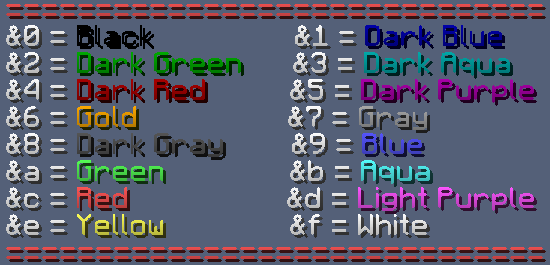

# ⭐ Návody k výhodám

## Příkazy

### Homes

* [x] **Rank Wood+**

Říkáme tomu anglicky, homes. Je to předem nastavené místo, kam se můžeš teleportovat kdykoliv, odkudkoliv.\
Např. end portál je příliš daleko a tak se k němu portneš pomocí příkazu.\
Pozor! Home si musíš nejdříve nastavit.\
Homes je vlastně krásné usnadnění hry.

#### Výtvoření Homu 

Home vytvoříš pomocí příkazu `/sethome [název]`. Např. `/sethome end`\
Později už budeš moci použít příkaz `/home end` a budeš u portálu.

[**Wood rank** ](seznam.md#wood)může použít příkaz `/home`, který ho portne ke své posteli. Nemůže si nastavit vlastní, ale pokud se chceš rychle dostat domů, hodí se.

## Ostatní Výhody 

### Psaní barevně do chatu 

* [x] **Rank Diamond+**

Od ranku Diamond se tato výhoda odemče.\
Existuje určitý syntax, kódy pro každou barvu. Ty jsou důležité znát aby jsi věděl jaká barva se skrývá pod kterým písmenkem nebo číslem. Ty najdeš [**zde**](https://minecraft.fandom.com/wiki/Formatting\_codes#Color\_codes) ve sloupci 'codes'.\
Je to vlastně jednoduché, před každé písmeno, které má mít jinou barvu musíš dát tuto kombinaci znaků:\
**&** + **(color code)**\
Např. `&aAhoj` `&eJak &dse &3vede&f?` `&4Č&7u&2s`


Spousta stránek ukazují znak **paragraf** - **§**.\
Ten ale náš server nepodporuje. Nahraď do ho **ampersandem** - **&**.


Pokud si chceš nastavit přezdívku ve hře, můžeš kontaktovat [Petyho](../server/staff.md#petyxbron) na Discordu, nebo vytvořit [ticket](../navody/uzitecne.md#ticket).

### Barevná přezdívka

* [x] **Rank Diamond+**

Barvu přezdívky si můžeš změnit pomocí nového příkazu **`/barva`**.\
Můžeš použít například: `/barva a` `/barva 4` `/barva f`

Alternativně si můžeš změnu barvy herní přezdívky vyžádat od [staff](../server/staff.md), třeba v [ticketu](../navody/uzitecne.md#ticket).

Nabízíme tyto barvy: (zadávej bez znaku `&`)

