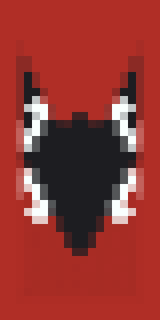
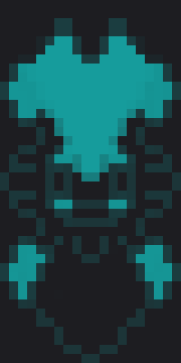
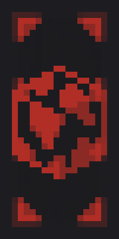
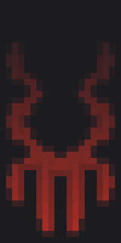

# ⚔️ Civilizace

## Definice a historie

SuroCraft Civilizace, zkráceně SC CIV je projekt založený na několikatýdenním eventu, který se týká převážně vanilla survivalu, ovšem s rozdělením na 4 týmy, takzvané klany.\
Ty se rozlišují třeba ve svých biomech, proto je projkt nazván jako Civilizace.

V tomto eventu je velká většina příkazů zrušena a tak ranky nemají skoro žádnou moc. Jediné zásadní co není vanilla jsou deathchestky a omezení území klanů s nastavením pvp.

Výhra eventu spočívá v získání co nejvíce bodů, které jsou možné získat za různé mini-eventy (parkour, dropper, bludiště, spleef, tnt-run, soutěž o nejlepší base, farmu apod.), krom těchto je možné získat jeden bod za zabití hráče a zároveň se jeden bod odečítá v případě úmrtí.

Klan má své území, na kterém se můžou pohybovat pouze jeho členové. Můžou ale jeho oblast opustit a vstoupit tak na "území nikoho". V zóně se ale můžou potkat se soupeři a tak riskují svůj život. Ovšem profit může vyjít z nalezení vesnice a získání vesničanů, nebo třeba rozěíření těžby a případně i území. Samozřejmě dalším účelem může být i lov soupeřů.

Projekt byl představen 17. února roku 2024 na platformě Discord, kde bylo účelem získat potvrzení zájmu hráčů. Asi do dvou dnů byla zpráva schopna nabýt 20 nebo více pozitivních reakcí. Za tři týdny bylo reakcí už 37, ovšem tu už dávno první event započal.

## První Civilizace

První event Civilizace měl název SC CIV 01. Ten byl zahájen v sobotu 2. 3. 2024 přímo na našem Minecraft serveru, kde se sešlo až 29 hráčů naráz.

Tento event se nám zrovna sešli 2 civilizace - snow a jungle. Pod každou civilizaci/biom ještě spadají 2 klany. To znamená, že dohromady 4 klany soupeřili mezi sebou. Těmi byly:

### Klany CIV 01

|  Název |                                 VLCI                                |                 DRACI                 |                 CPS                 | HELLTOWN                             |
| :----: | :-----------------------------------------------------------------: | :-----------------------------------: | :---------------------------------: | ------------------------------------ |
|   Tag  |                <mark style="color:orange;">VLK</mark>               | <mark style="color:green;">DRK</mark> | <mark style="color:red;">CPS</mark> | <mark style="color:red;">HLT</mark>  |
| Banner |  |      |      |  |
|  Vůdce |                              Smrtka\_sk                             |            Bigwolfikstudio            |              Arnackist              | Sunka01                              |
|  Biom  |                                 snow                                |                  snow                 |                jungle               | jungle                               |

#### Vlci

Klan vlků je ve vedení Smrtky, jednoho z hráčů, který na SuroCraftu hraje již několik let. Společně s pomocí hráčů PetyXbron a Dominen sestavil tým starých dobrých přátel, skládající se hlavně ze staff a helper týmu. Jejich vlajka reprezentuje černobíleho vlka na červeném pozadí a jsou součástí sněžného biomu.

#### Draci

Draci mají jako šéfa Wolfika, který si drží rank YouTubera na našem serveru. Tvořil klan ze všech ostatních jako úplně poslední a tak je převážně sestaven ze zbylých hráčů, což ale paradoxně přivzalo i pár dost zkušených hráčů, kteří dokázali klan udržet nad vodou a zároveň později i na jedné z nejvyšší příček v žebříčku. Významními jsou například Louskal, Wertical, Xortyz a HypedMortos.

#### CPS

Klan CPS je již dost známým kultem na našem serveru, skládá se hráčů Arnackist, Katryn, Seezy, Misko, Chaos, Mammaly, Galaxy a dalších. Ti totiž patří z historicky význámným z důvodu kontroverzního chování a porušování pravidel, naopak ale jejich společná síla a aktivita byla jedna z nejvyšších a tak se dodnes drží jako přijatelní.

#### HellTown

HellTown je původně klan založený známým hráčem Miferem, který ale kvůli své neaktivitě přenechal korunu hráči Sunka. Na základě zájmů, strategie a chování je přirovnatelný k hráčům CPS. Mezi HLT patří třeba hráč s nejvíce nahranými hodinami - Pohodovej\_Rybar, nebo třeba ReyLagndir, který se podobně jako CPS proslavil právě kvůli kontroverznímu chování a přístupu s dodáním obcházení trestů.

### Videa

Před prvním eventem bylo nutné přátelsky seznámit hráče nějakým trailerem, který by zapříčinil příblížení chápání o celém projektu, zároveň se jedná o dobře graficky zpracované dílo, které může nadchnout filmové fanoušky.


Trailer na SC CIV 01


Zahájení SC CIV 01 - 2. března, bylo také streamováno na YouTube, kde bylo přes více než 10 diváků najednou. Obsah nejen jako záznam dokázal vyprodukovat nad 120 zhlédnutí.


Dvouhodinový stream ze zahájení prvního eventu


Zároveň byly pořízeny i snímky z jednotlivých mini-eventů:


Záznam z prvního mini-eventu: Parkouru 1



Záznam z prvního mini-eventu: Parkouru 2

