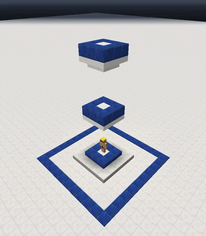

# Výtahy

### Video Tutoriál 




**Příkaz `/elevator create` byl zrušen a je podporována jen manuální tvorba.**


### Jak fungují? 

Není to žádná stoupající a klesající plošina jako v reálném životě. Je to jednodušší. Výtah tu funguje jako teleportace mezi dvěma nebo více [určitými](elevator.md#kombinace) bloky.

### Variace výtahů 


**Nejaktuálnější kombinace výtahů najdeš pod příkazem** `/elevator list`**.**


Aby výtah nemohl být vytvořen jen tak, existuje více variací bloků, speciálních bloků.

#### Bloky, z kterých vytvořit výtah 

| Číslo Kombinace | Spodní Blok                                                      | Vrchní Blok                                                                                                               |
| --------------- | ---------------------------------------------------------------- | ------------------------------------------------------------------------------------------------------------------------- |
| 1               | [Blok Železa](https://minecraft.fandom.com/wiki/Block\_of\_Iron) | Zelený Koberec (ID 5)                                                                                                     |
| 2               | [Blok Železa](https://minecraft.fandom.com/wiki/Block\_of\_Iron) | Křemenný Půlblok                                                                                                          |
| 3               | [Blok Železa](https://minecraft.fandom.com/wiki/Block\_of\_Iron) | [Navoskovaný Půlblok Pokrytý měděnkou](https://www.digminecraft.com/block\_recipes/make\_oxidized\_cut\_copper\_slab.php) |
| 4               | [Blok Železa](https://minecraft.fandom.com/wiki/Block\_of\_Iron) | [Oloupaná Přízračná Třeň](https://minecraft-heads.com/custom-heads/blocks/36275-stripped-warped-stem)                     |
| 5               | [Blok Železa](https://minecraft.fandom.com/wiki/Block\_of\_Iron) | [Mořská Lucerna](https://minecraft.fandom.com/wiki/Sea\_Lantern)                                                          |
| 6               | [Blok Železa](https://minecraft.fandom.com/wiki/Block\_of\_Iron) | [Smaragdový Blok](https://minecraft.fandom.com/wiki/Block\_of\_Emerald)                                                   |
| 7               | Plačící Obsidián                                                 |                                                                                                                           |

