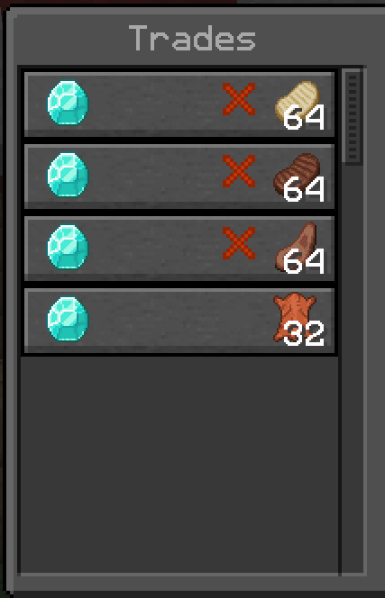

# Propojení účtů

Jak už všichni víme, SuroCraft podporuje hráče na edici Java i Bedrock.\
Někteří z nás hrají pouze na mobilu, někteří jen na pc.\
Ale co když hraješ na pc a někdy si zahraješ i na mobilu?\
**Je lepší si propojit účty k synchronizaci předmětů, bloků, brnění v inventáři nebo třeba rank atd.**


**Mohou se vám ztratit věci z inventáře! Zálohujte si je i s ender bednou!**


### Propojení

#### Otevři v internetovém prohlížeči stránku [link.geysermc.org](https://link.geysermc.org/)

* Pokud máš propojený java účet s Microsoft účtem, zvol '**Online linking**' a řiď se instrukcemi z webu.
* Pokud ne a máš pořád Mojang účet, zvol možnost '**Server linking**'.\
  Web ti ukáže IP adresu, kam se máš připojit s každým zařízením a podle instrukcí budeš pokračovat.

Až budeš mít hotovo a budeš si jistý, že máš propojený účet, na server se můžeš v klidu připojit a oba účty by měli být jak stejný hráč.
