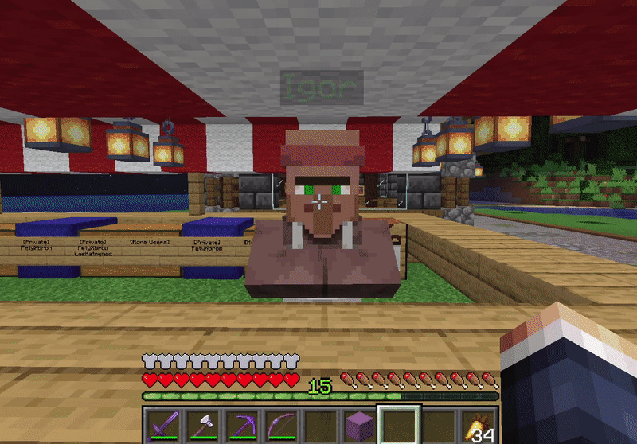

# Shopkeepers

## Co jsou Shopkeepeři? 

Shopkeepeři jsou vesničani, či jiné entity, přes které se dá obchodovat jako s normální vesničanem, akorát ty obchody si můžete nastavit a vytvořit tak vlastní obchod na systému vlastního vesničana. Na této stránce také najdete [tutoriál](shopkeepers.md#tutorial), jak ho můžete vytvořit.

.png>)

Vypadá vlastně úplně stejně jako normální vesničan.\
Dáte jeden dia, získáte stak ([?](https://minecraft.fandom.com/wiki/Inventory#Slots)) vlny. Pokud zboží dojde, zobrazí se u jednotlivých obchodů křížek, který znamená, že nelze obchodovat - došli zásoby.

Pokud samozřejmě chceš něco ze zásob koupit, musíš vložit do prvního okénka jeho cenu. V našem případě, musíme dát jeden diamant, abychom koupili 32 kůže.

.png>)

Poté klikneme na 32 kůže, za které my platíme a obchod bude proveden.

#### GIF Ukázka

## Návod 

Nejdůležitější krok, který je třeba podstoupit k pořízení vlastního obchodníka je použití následujícího příkazu.

Velmi doporučujeme znalost předchozího tématu, což umožňuje lepší orientaci v následujícím návodu.

### 1. Získání vejce shopkeepera

Pomocí příkazu **`/shop`** získáš vejce, které poté můžeš někde položit k zrození vlastního vesničana.

### 2. Nastavení výměnného obchodu

Většina hráčů má nastavený u shopkeepera **výměnný obchod**.\
Je to vlastně typ obchodu, který umožňuje majiteli nastavit, jaké přesné předměty musí hráč odevzdat, aby dostal jiné předměty.\
Tzn. můžeš nastavit, že budeš prodávat 64 kamene za 2 emeraldy, nebo jakékoliv jiné předměty.

Před položením vejce je nutné nastavit tento typ.\
**Miř volně do vzduchu**, nebo na vodu a použij na počítači **pravé tlačítko**.\
Na telefonu stačí podržet displej.\
Nesmíš mířit na jakýkoliv blok, jinak dojde ke spawnu shopeekepera.\
Klikáním na pravé tlačítko budeš měnit typy obchodů. V chatu si je můžeš zjistit, jakmile se "doklikáš" k "**Trading Shop**" (Výměnný obchod), nech ho tak a už můžeš spawnout obchodníka.


Na telefonu mohou být potíže s nastavením. Neváhej [založit ticket](uzitecne.md#ticket).


### 3. Spawnutí obchodníka

Velmi jednoduchý krok. Stačí **pravým tlačítkem** (na telefonu podržet displej).\
Zjeví se na bloku tvůj vesničan.

### 4. Úprava vesničana

Samotného vesničana si můžeš upravit při **plížení** (`shift`) a kliknutí **pravým tlačítkem** (na telefonu mířit na vesničana a podržet displej) otevřeš **menu úpravy vesničana**.\
Zde můžeš upravit vesničanovu profesi, vzhled, věk, jméno a další.

### 5. Nastavení jednotlivých obchodů

Po spawnutí obchodníka je možné vstoupit do menu úpravy pomocí **plížení** (`shift`) a kliknutí **pravým tlačítkem** (na telefonu mířit na vesničana a podržet displej) na vesničana.

V **menu úprav** je možné nastavit jednotlivé obchody. Tento obrázek (v angličtině) ti umožní orientaci v menu.\
.png>)\
Při výměnném typu obchodu přidáváme do řádku (**result**) předmět, nebo blok, který prodáváme.\
Do třetího řádku (**Cost 1**) vkládáme hlavní cenu. Například nějaké diamanty.\
Druhý řádek (**Cost 2**) umožňuje nastavit dokonce ještě další cenu pro získání produktu.
