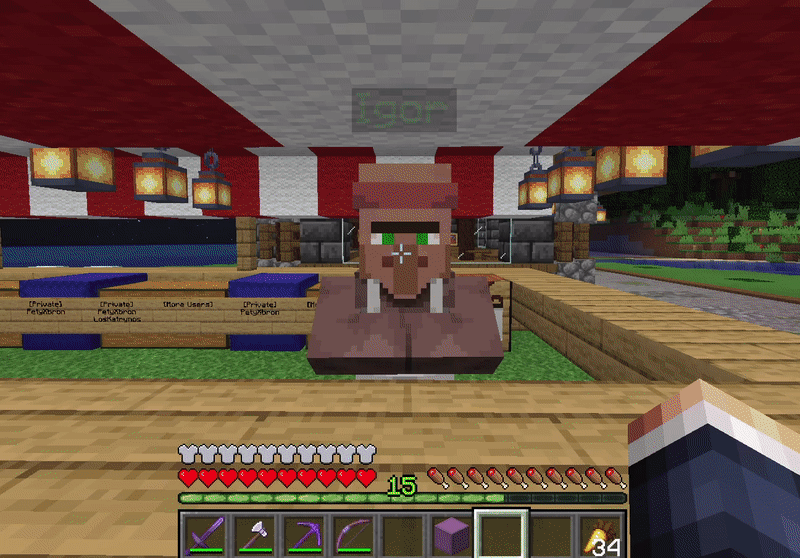

# Shopkeepers

## Co jsou Shopkeepeři? 

Shopkeepeři jsou vesničani, či jiné entity, přes které se dá obchodovat jako s normální vesničanem, akorát ty obchody si můžete nastavit a vytvořit tak vlastní obchod na systému vlastního vesničana. Na této stránce také najdete [tutoriál](shopkeepers.md#tutorial), jak ho můžete vytvořit.

.png>)

Vypadá vlastně úplně stejně jako normální vesničan.\
Dáte jeden dia, získáte stak ([?](https://minecraft.fandom.com/wiki/Inventory#Slots)) vlny. Pokud zboží dojde, zobrazí se u jednotlivých obchodů křížek, který znamená, že nelze obchodovat - došli zásoby.

.png>)

Pokud samozřejmě chceš něco ze zásob koupit, musíš vložit do prvního okénka jeho cenu. V našem případě, musíme dát jeden diamant, abychom koupili 32 kůže.

.png>)

Poté klikneme na 32 kůže, za které my platíme a obchod bude proveden.

#### GIF Ukázka

## Návod 


**Již brzy**

