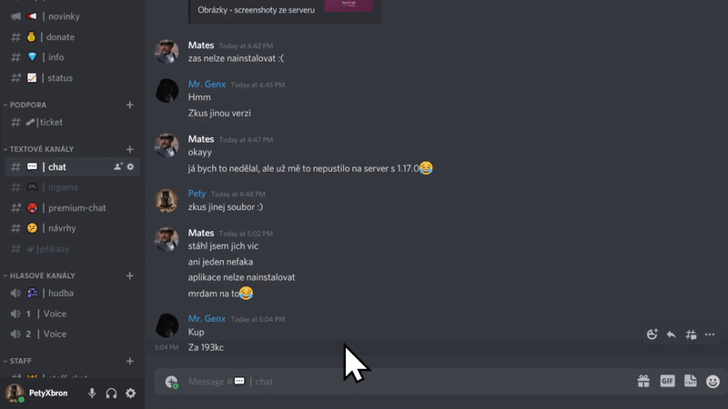

# Užitečné

## Příkazy

### Portovací příkazy 

* [x] Rank Hráč+ pro `/spawn`
* [x] Rank Wood+ pro `/tpr`

Pro ulehčení práce vaším kostičkovaným nohám jsme přidali příkazy na rychlé přesuny. Týká se to příkazu `/spawn` a `/tpr.` `/spawn` je povolený pro všechny, ale `/tpr` je povolen pouze za vote (rank [Wood](../ranky/seznam.md#wood) nebo vyšší).

Logicky, `/spawn` příkaz tě portne na spawn. Na spawnu máme obchody a výstavku. Jedná se tak o "Serverové tržiště", či "Serverové Náměstí".

Příkaz `/tpr` tě náhodně portne po světě (Pro rozmístění pro survival)

### Přehození předmětu do druhé ruky 

* [x] **Pouze Bedrock hráči**
* [x] **Rank Hráč+**

Každý uživatel Bedrock edice ([?](../server/slovnicek.md#bedrock-java-edition)) může ve hře použít příkaz `/geyser offhand`\
Po použití příkazu se aktuální předmět nebo blok přesune do druhé ruky.

Tento příkaz je dostupný pouze Bedrock hráče a na Javě je zablokovaný. Pokud chceš si chceš na Javě dát do druhé ruky předmět nebo blok, výchoze je to nastaveno na klávese `f`. Nebo v inventáři můžeš taky předmět nebo blok přetáhnout do okénka se štítem.

## Ostatní

### Podpora - Založení ticketu 

Nevíš jak kontaktovat [staff](../server/staff.md) (Admin Team)? Zde máš návod.

#### 1. Připojení k Discordu 

Nejdříve se musíš připojit na Discord server. Odkaz [**zde**](https://discord.gg/W4yguRbT34).\
Pokud si tak ještě neudělal, přečti si [pravidla serveru](../server/pravidla/).

#### 2. Založení ticketu v kanále 

Běž v Discord serveru do kanálu **#ticket**, zde uvidíš zprávu pod které je tlačítko. Na to klikneš a vytvoří se nový kanál, tam si můžeme začít psát.

Pokud jsi na mobilním zařízení, je nutné si aktualizovat aplikaci Discord a mít Android 7 nebo vyšší. Jinak se neukáže důležité tlačítko "Create Ticket".
